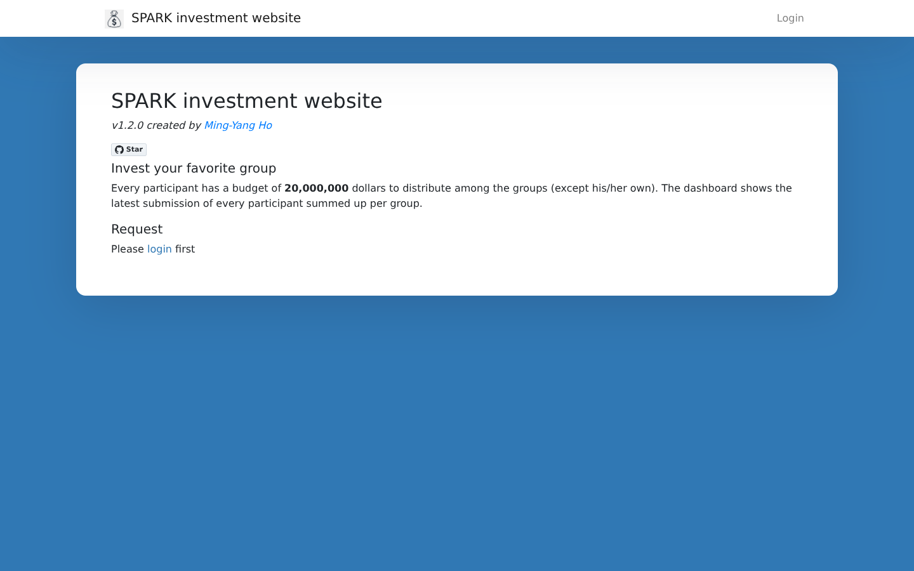

# SPARK Investment website

A small full-stack web app for running an *"invest in your favourite group"*
game: every participant gets a fixed virtual budget (20,000,000 dollars) to
distribute among 12 groups (all except their own). An admin manages accounts and
a live dashboard shows the aggregated latest submission of every participant
per group.

| Layer     | Tech                                                                                  |
|-----------|---------------------------------------------------------------------------------------|
| Frontend  | React 17 (Create React App / `react-scripts` 5), react-router v5, Bootstrap 4, MUI 5, Recharts, axios |
| Backend   | Python 3.9+ / Flask 2.2, Flask-JWT-Extended, Flask-SQLAlchemy + marshmallow, served by gunicorn |
| Database  | MySQL 8 (any SQLAlchemy URI works, e.g. SQLite for local development)                 |
| Deploy    | Docker Compose: nginx (static build + `/api` reverse proxy) → gunicorn → MySQL         |



More screenshots live in [`screenshots/`](screenshots/).

## Features

* **Login** with account/password (SHA-256 hashed, JWT access tokens, 1 h lifetime, transparently refreshed).
* **Request** page – distribute the budget across the groups; live "left with" counter, own group is locked.
* **Dashboard** – bar chart of the latest submission of every user summed per group, auto-refreshes.
* **Personal** page – change your own password.
* **Admin** page (only for the account named in `ADMIN_ACCOUNT`) – create users, reset any password.

## Project layout

```
backend/        Flask API (server.py), models/, schemas/, tests/
frontend/       React app (src/container = pages, src/components = widgets)
nginx/          nginx config used by the frontend container
*.Dockerfile    backend / frontend images
docker-compose.yml
```

## Production mode (Docker Compose)

1. Create a `.env` file next to `docker-compose.yml`:
   ```env
   MYSQL_ROOT_PASSWORD=change-me
   SQLALCHEMY_DATABASE_URI=mysql+pymysql://root:change-me@db:3306/spark
   JWT_SECRET_KEY=a-long-random-string-at-least-32-characters
   ADMIN_ACCOUNT=root
   ```
   The database name (`spark`) must match `backend/sql/create_user.sql`.
2. Edit `backend/sql/create_user.sql` to set the initial accounts. It is only
   executed the **first** time the database volume is created and by default
   creates `root/root` (admin) and `test/test` – **change them**.
3. Build and start:
   ```bash
   docker-compose up --build -d
   ```
   The site is served on <http://localhost:21000>.

## Development mode

### Backend

```bash
cd backend
python -m venv .venv && source .venv/bin/activate
pip install -r requirements.txt

export JWT_SECRET_KEY=dev-secret-key-that-is-long-enough-1234
export SQLALCHEMY_DATABASE_URI=sqlite:///dev.db      # or a MySQL URI
export ADMIN_ACCOUNT=root
python server.py                                     # http://localhost:5000
```

Tables are created automatically on the first request. With SQLite there is no
seed script, so create the first (admin) user directly:

```bash
python -c "
import server
from models import UserModel
from security import get_sha256
with server.app.app_context():
    server.db.create_all()
    server.db.session.add(UserModel('root', 0, get_sha256('root')))
    server.db.session.commit()
"
```

### Frontend

```bash
cd frontend
yarn install
yarn start        # http://localhost:3000, /api/* is proxied to localhost:5000
```

### Tests & lint

```bash
# backend
cd backend && flake8 . && pytest -q

# frontend
cd frontend && CI=true yarn build && yarn test --watchAll=false
```

Both run in GitHub Actions on every push / pull request (`.github/workflows/node.js.yml`).

## API

All routes except `/api/token`, `/api/logout` and `/api/version` require an
`Authorization: Bearer <token>` header.

| Method | Route                     | Who    | Description                                  |
|--------|---------------------------|--------|----------------------------------------------|
| POST   | `/api/token`              | anyone | `{account, password}` → `{access_token}`     |
| POST   | `/api/validate`           | user   | check token (refreshed when < 30 min left)   |
| GET    | `/api/personal/donation`  | user   | latest own submission (zeros if none)        |
| POST   | `/api/submit/donation`    | user   | form fields `group_one` … `group_thirteen`   |
| GET    | `/api/dashboard/donation` | user   | `[{name, dollars}]` per group                |
| GET    | `/api/personal/listuser`  | user   | own account + group                          |
| POST   | `/api/personal/changepwd` | user   | form `account` (self), `password`            |
| GET    | `/api/admin/verify`       | user   | `{isAdmin}`                                  |
| GET    | `/api/admin/listuser`     | admin  | all users                                    |
| POST   | `/api/admin/createuser`   | admin  | form `account`, `category`, `password`       |
| POST   | `/api/admin/changepwd`    | admin  | form `account`, `password`                   |
| GET    | `/api/version`            | anyone | API version                                  |
